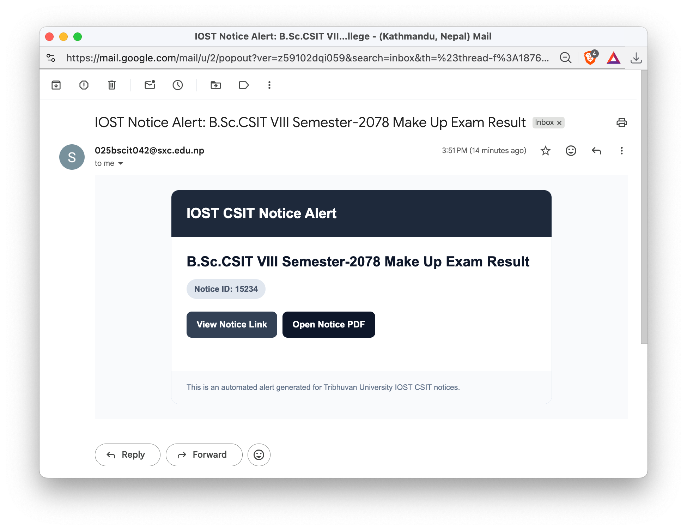
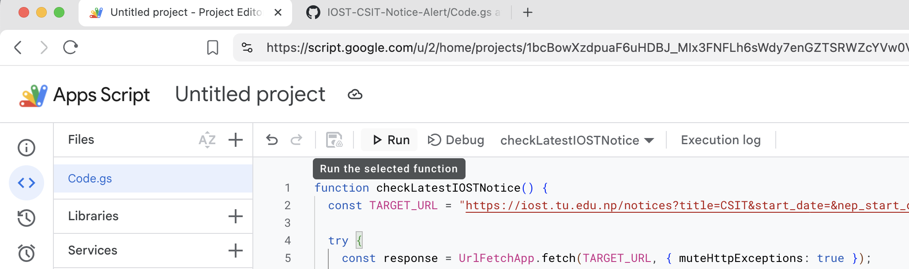
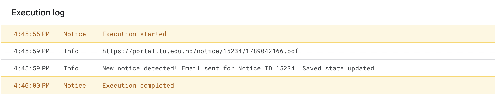
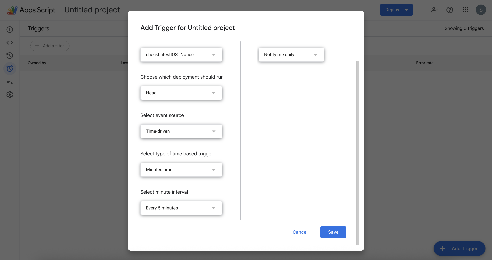

# IOST CSIT Notice Alert

Automatically receive an email whenever a new CSIT notice is published by the Institute of Science and Technology (IOST), Tribhuvan University.

This project runs entirely on Google Apps Script. Each user deploys their own copy, so notices are checked using their own Google account and emails are sent to their own email address.



## Features

* Automatically checks the IOST CSIT notice page
* Detects newly published notices
* Extracts the notice details
* Sends an email when a new notice is detected
* Remembers the last notice it processed
* Runs automatically using a time-based trigger

## Installation

1. Go to `https://script.google.com/` and click on `+ New Project`.
2. Copy the `Code.gs` file, paste it into the project, and save it.
3. Click **Run** with the `checkLatestIOSTNotice` function selected.



4. You'll see a popup saying **"Authorization required"**. Approve it.

   > Click on `Review permissions` => `Advanced` => `Go to IOST-CSIT-Notice-Alert (unsafe)` => `Continue` => `Select all` => `Continue`.
   >
   > Google is asking you to authorize the permissions required to:
   > * Send emails

5. You should see:



You should also receive an email from your own Google account containing the latest notice.

6. Go to the **Triggers** tab, click **Add Trigger** at the bottom right, and choose `Minutes timer` => `Every 5 minutes`.



The script will now periodically check the IOST CSIT notice page.

When a new notice is published, you will receive an email containing:

* Notice title
* Notice ID
* Notice URL
* PDF URL

## Additional info

* The script is configured for CSIT notices by default.
* The monitored page is:

```text
https://iost.tu.edu.np/notices?title=CSIT&start_date=&nep_start_date=&end_date=&nep_end_date=&notice_type=21
```

* The email recipient is automatically determined from the Google account running the script.

* If you need to reset the stored notice ID, run:

```javascript
function resetProperties() {
  const scriptProperties = PropertiesService.getScriptProperties();
  scriptProperties.deleteAllProperties();
}
```

## Disclaimer

This is an unofficial project and is not affiliated with, endorsed by, or sponsored by the Institute of Science and Technology, Tribhuvan University.

## License

MIT License